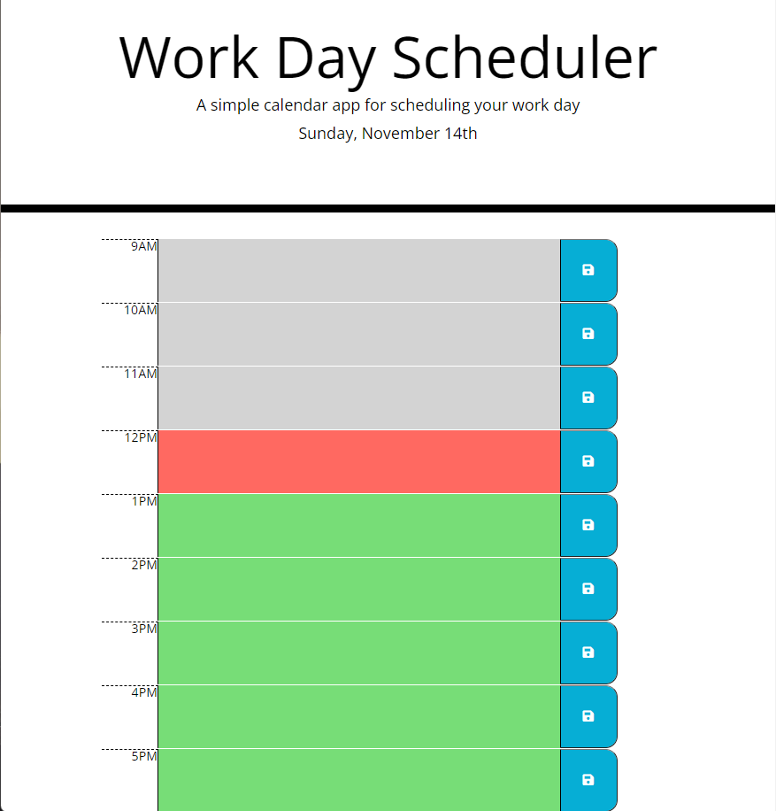

# Challenge Five Work Day Scheduler

## Purpose
A simple calendar app for scheduling your work day

## Description
This project uses third party libraries to demonstrate a proficency in resource utilization. 

## Built With
* HTML
* CSS
* JavaScript

## Third Party Libraries
* Moment.JS
* JQuery
* Font Awesome
* Bootstrap
* Google Fonts

## Website
You can view the live deployment [HERE](https://esimondet.github.io/challenge-five-work-day-scheduler/)

## Screenshot of landing page

## Contribution
HTML and CSS supplied by the U of M Bootcamp, Javascript by Edison Simondet
